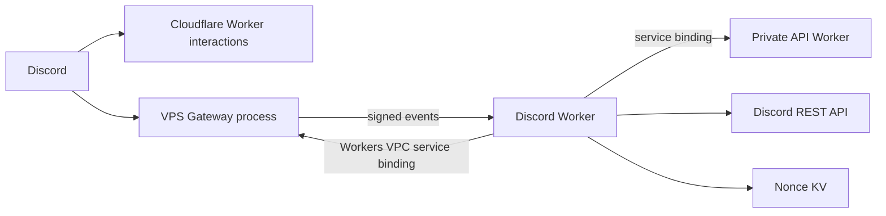
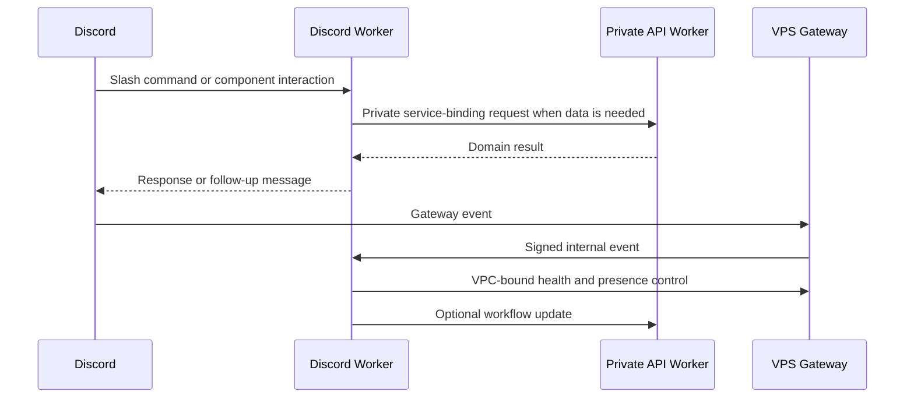

# Purdue Photo Discord

<div align="center">

Discord automation platform for Purdue Photography Club: slash commands, staff workflows, server health, role sync, studio/darkroom notifications, and a lightweight Gateway forwarder.

[](https://github.com/PurduePhotographyClub/purdue-photo-discord/actions/workflows/ci.yml)


</div>

## What It Does

This repo contains the Discord side of the club platform. A Cloudflare Worker handles interactions, commands, buttons, modals, website notifications, and API-bound actions. A small VPS Gateway process keeps a Discord Gateway session online and forwards selected events to the Worker.

## Architecture



## Runtime Split

| Package | Runs on | Responsibility |
| --- | --- | --- |
| `apps/discord-worker` | Cloudflare Workers | Discord interactions, slash commands, signed Gateway events, API Worker calls, Discord REST messages |
| `apps/discord-gateway` | VPS Node.js process | Persistent Discord Gateway session, presence, event filtering, and signed forwarding |
| `packages/shared` | Shared TypeScript package | Internal event contracts used by the Worker and Gateway |

## Workflow



## Capabilities

| Area | Examples |
| --- | --- |
| Slash commands | Health, wiki, status, admin tools, key redemption, studio/darkroom helpers |
| Dashboard sync | Website reports, studio requests, film request review, equipment workflows |
| Verification | Discord server membership, account-age policy, website verification support |
| Gateway events | Reaction/message/member forwarding when enabled for a deployment |
| Security | Discord signature validation, signed Gateway events, nonce replay protection, minimal Gateway intents |

## Development

```sh
npm install
npm run dev:worker
npm run dev:gateway
```

Runtime secrets and deployment-specific settings are managed outside this public repository.

## Verification

```sh
npm run typecheck
npm run lint
npm run build
npm run doctor
npm run verify
```

`npm run build` compiles the Gateway and performs a dry-run Worker build. CI runs the same verification surface plus dependency and secret-pattern checks.

## Project Map

```text
apps/
  discord-worker/
    config/                 Slash command registry
    src/
      commands/             Admin and general command handlers
      components/           Buttons, selects, and modals
      discord/              Discord API, response, signature, and type helpers
      http/                 Gateway request authentication
      routes/               Worker route handlers
      services/             Domain-specific Discord integrations
      utils/                Environment, logging, JSON, and error helpers
  discord-gateway/
    src/
      config.ts             Runtime config parsing and intent selection
      discord/              discord.js client and event forwarding
      http/                 Gateway health and command HTTP server
      utils/                Structured log redaction
packages/
  shared/                   Internal event type contracts
```

## Deployment Notes

The Worker and Gateway are deployed separately so the always-on Gateway can stay small and isolated. The Gateway deploy package is generated by:

```sh
npm run gateway:prepare-deploy
```

The generated package contains only the compiled Gateway, a minimal `package.json`, systemd template, and server hook template. It does not include Worker source, Wrangler config, website code, API code, or secret material.

Worker-to-Gateway control traffic uses the `GATEWAY_SERVICE` Workers VPC binding in `apps/discord-worker/wrangler.toml`. The binding points at the `gateway-discord` VPC Service, which routes through the `gateway` Cloudflare Tunnel to the Gateway process listening on the VPS private interface. The API Worker does not bind to the Gateway directly; API-initiated Discord workflows continue through the Discord Worker service binding.

## Assets And Licensing

This repo does not bundle photography or brand image assets. Discord product names and marks belong to Discord. Source code and generated command definitions are owned by Purdue Photography Club unless another file states otherwise.
