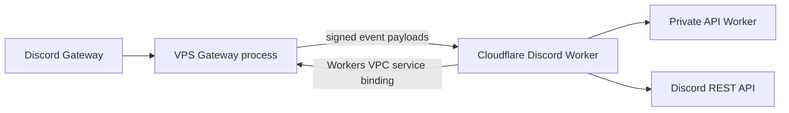

# Gateway VPS Deploy

This guide describes the public deploy shape for the Discord Gateway without publishing runtime variable names or secret setup details. Keep the concrete server configuration in the private operator runbook.

## What Runs Where



## Local Build

From the repo root:

```sh
npm install
npm run typecheck
npm run lint
npm run build:gateway
```

The Gateway is intentionally small: it connects to Discord, keeps presence online, filters configured event families, signs event payloads, and forwards them to the Worker.

## Generate The Gateway Deploy Package

```sh
npm run gateway:prepare-deploy
cd deploy/discord-gateway
git status
```

The generated deploy repository contains only:

- `dist/`
- `package.json`
- `systemd/`
- `server/`

It does not contain Worker source, Wrangler config, website code, API code, or secret material.

## First-Time VPS Shape

On the server:

```sh
sudo apt update
sudo apt install -y git curl
curl -fsSL https://deb.nodesource.com/setup_22.x | sudo -E bash -
sudo apt install -y nodejs
node --version
npm --version
```

Create a service user, a bare git repo, and a working tree:

```sh
sudo useradd --system --create-home --home-dir /opt/pccbot --shell /bin/bash pccbot
sudo mkdir -p /opt/git/pccbot-discord-gateway.git /opt/pccbot-discord-gateway
sudo git init --bare /opt/git/pccbot-discord-gateway.git
sudo chown -R pccbot:pccbot /opt/git/pccbot-discord-gateway.git /opt/pccbot-discord-gateway
```

Runtime configuration should be created from the private operator runbook, owned by root, readable by the service group only, and never committed.

The Gateway HTTP server only needs to be reachable by `cloudflared` on the VPS/private network. Do not expose its host or port publicly. The Discord Worker reaches it through the `GATEWAY_SERVICE` Workers VPC binding, whose service ID is declared in the Worker Wrangler config.

## Push Gateway Code To Server

Inside `deploy/discord-gateway`:

```sh
git remote add vps ssh://USER@SERVER/opt/git/pccbot-discord-gateway.git
git push vps main
```

On the VPS, check out the first version:

```sh
sudo -u pccbot git --git-dir=/opt/git/pccbot-discord-gateway.git --work-tree=/opt/pccbot-discord-gateway checkout -f main
cd /opt/pccbot-discord-gateway
sudo -u pccbot npm install --omit=dev --ignore-scripts
```

Install the systemd service:

```sh
sudo cp /opt/pccbot-discord-gateway/systemd/pccbot-discord-gateway.service.example /etc/systemd/system/pccbot-discord-gateway.service
sudo systemctl daemon-reload
sudo systemctl enable --now pccbot-discord-gateway
```

Check logs:

```sh
sudo systemctl status pccbot-discord-gateway
sudo journalctl -u pccbot-discord-gateway -f
```

## Optional Auto-Deploy On Git Push

Copy the hook:

```sh
sudo cp /opt/pccbot-discord-gateway/server/post-receive.example /opt/git/pccbot-discord-gateway.git/hooks/post-receive
sudo chmod +x /opt/git/pccbot-discord-gateway.git/hooks/post-receive
sudo chown pccbot:pccbot /opt/git/pccbot-discord-gateway.git/hooks/post-receive
```

Allow the service user to restart only this service through sudoers. Keep the exact sudoers line in the private operator runbook.

## Security Notes

- The deploy package is Gateway-only.
- Runtime configuration lives outside git.
- Gateway-to-Worker traffic is signed and replay-protected.
- Worker-to-Gateway control traffic uses Workers VPC through Cloudflare Tunnel; no public VPS IP or port is required in Worker config.
- Gateway event scope should stay minimal; only enable event families that are actively used.
- Worker and API logic remain on Cloudflare, not on the VPS.
