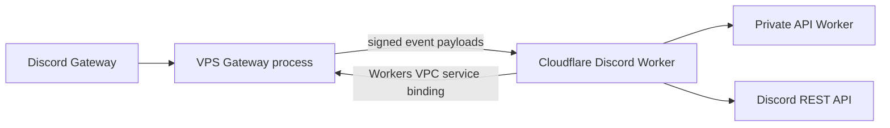

# Gateway VPS Deployment

The Discord Gateway deploys automatically after a verified change reaches `main`. The production path uses an immutable release, a restricted non-root SSH key, an atomic release switch, a readiness check, and automatic rollback.

Runtime secrets remain on the VPS. They are never copied into GitHub Actions, the release artifact, or the deployment Git repository.

## What Runs Where


```mermaid
flowchart LR
  Discord["Discord Gateway"] --> VPS["VPS Gateway process"]
  VPS -->|signed event payloads| Worker["Cloudflare Discord Worker"]
  Worker -->|Workers VPC service binding| VPS
  Worker --> API["Private API Worker"]
  Worker --> DiscordREST["Discord REST API"]
```

The VPS owns the long-lived Discord connection and latency-sensitive scam quarantine. The Worker owns slash commands, Cloudflare integrations, and the remaining Discord workflows.

## Automatic Release Flow

The `CI` workflow performs one verified build:

1. Install, test, typecheck, lint, build, run React Doctor, audit dependencies, and scan for committed secret patterns.
2. Package the already-built Gateway output with its pinned production manifests.
3. Add source-commit and workflow provenance to `release.json`.
4. Generate and verify `SHA256SUMS` for every release file.
5. Test a clean production-only dependency install.
6. Upload the SHA-qualified release artifact.
7. After `verify` succeeds, deploy the Worker and Gateway in separate production jobs.

Gateway deployment runs for either:

- a push to `main`, including a normal merged pull request; or
- the trusted auto-merge workflow's explicit post-merge dispatch.

A normal manual workflow dispatch verifies only. An operator must deliberately enable the `deploy_merged_main` input to use the manual production fallback.

When this automation is enabled for the first time, the merge that introduces it is handled by the older auto-merge workflow already on the default branch. After that bootstrap merge, run `CI` once on `main` with `deploy_merged_main` enabled. Later trusted merges dispatch the deployment-enabled workflow automatically.

The deploy job checks `origin/main` again immediately before pushing. The VPS also rejects an older workflow run or a repeated attempt, so a delayed job cannot replace a newer release.

## Release Contract

The production payload contains only:

```text
dist/**
package.json
package-lock.json
release.json
SHA256SUMS
```

The package is rejected if a checksum fails, a file is missing, an unexpected file appears, a symbolic link is present, the repository provenance is wrong, or the Node major version is not 22.

The deployment Git repository remains an immutable transport ledger. Each deploy commit maps the verified source SHA and workflow run to one release directory on the VPS.

## VPS Privilege Boundary

The runtime and deployment identities are separate:

- `pccbot` runs the Gateway service.
- `pccbot-deploy` receives release commits and owns release directories.
- `pccbot-release` is a non-secret shared group used only to make immutable releases readable by the runtime process. The `releases/` directory is setgid to this group, and both identities belong to it.
- GitHub's key is forced through `pccbot-gateway-git-command`; it can run only `git-upload-pack` or `git-receive-pack` for the Gateway deployment repository.
- The deployment user can restart only `pccbot-discord-gateway.service` through sudo.
- Server hooks and deployment helpers are root-owned and are not part of the application payload.

The relevant checked-in templates are:

- `apps/discord-gateway/server/gateway-release.mjs`
- `apps/discord-gateway/server/gateway-server-deploy.mjs`
- `apps/discord-gateway/server/pccbot-gateway-git-command`
- `apps/discord-gateway/server/pre-receive.example`
- `apps/discord-gateway/server/post-receive.example`
- `apps/discord-gateway/systemd/pccbot-discord-gateway.service.example`

The GitHub `production` environment needs:

- Secret `GATEWAY_DEPLOY_SSH_KEY`
- Secret `GATEWAY_VPS_KNOWN_HOSTS`
- Variable `GATEWAY_DEPLOY_HOST`
- Variable `GATEWAY_DEPLOY_PORT`
- Variable `GATEWAY_DEPLOY_USER`

Pin the host key from a trusted VPS console. Do not discover it dynamically during a workflow run.

Restrict the `production` environment to `main`. Keep `/etc/pccbot-discord-gateway.env` on the separate runtime-only `pccbot` group; `pccbot-deploy` must not be able to read it.

## Promotion And Rollback

The receive hook deploys the exact received revision, never a mutable branch name:

1. Verify the Git tree, provenance, file allowlist, and checksums.
2. Extract into a new staging directory under `releases/`.
3. Run `npm ci --omit=dev --ignore-scripts` and a JavaScript syntax check.
4. Rename the completed staging directory to `releases/<deploy-commit>`.
5. Atomically point `current` to the new release and restart the service.
6. Require `/health` to report the Gateway, Discord connection, and moderation subsystem ready.
7. On success, record `previous` and update `refs/deployed/main`.
8. On failure, restore the old `current` link, restart it, verify its health, and leave the deployed ref unchanged.

GitHub requires `refs/deployed/main` to equal the commit it pushed. A failed activation or rollback therefore fails the deployment job even though the Git transport accepted the release commit.

## Runtime Configuration

The service reads `/etc/pccbot-discord-gateway.env`. Keep that file outside every release, owned by root, and readable only by the runtime group. The Gateway listener should remain reachable only through the local Cloudflare Tunnel/private path.

The service runs Node directly from `/opt/pccbot-discord-gateway/current`. Its systemd sandbox makes the host filesystem read-only to the process and removes unnecessary devices, capabilities, home-directory access, and kernel or control-group mutation.

## Local Release Check

For an operator preview only:

```sh
npm run gateway:prepare-deploy
cd deploy/discord-gateway
git status
```

This produces the same allowlisted release format and verifies it locally. Production releases should use GitHub Actions so the artifact retains trusted workflow provenance and passes the protected environment gate.

## Production Verification

After a deployment, verify all of the following:

- the `deploy-gateway` job is green;
- the pushed deploy commit equals `refs/deployed/main`;
- `current` points at that revision's release directory;
- `pccbot-discord-gateway.service` is active;
- the local `/health` response is ready, including moderation;
- recent service logs contain no startup or configuration errors; and
- the Cloudflare Tunnel reports healthy.
